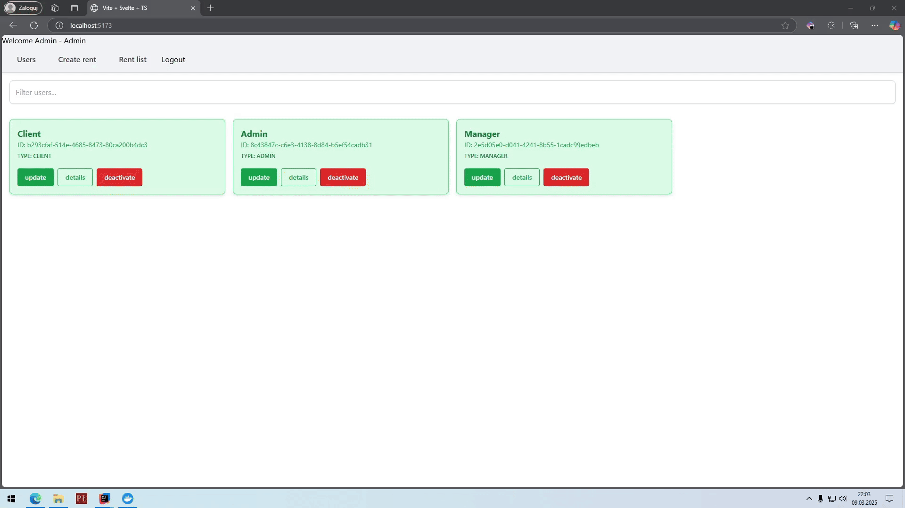

<h3 align="center">

<pre>
 __          __           _                 _____               _          _ 
 \ \        / /          | |               |  __ \             | |        | |
  \ \  /\  / /___   _ __ | | __ ___  _ __  | |__) | ___  _ __  | |_  __ _ | |
   \ \/  \/ // _ \ | '__|| |/ // _ \| '__| |  _  / / _ \| '_ \ | __|/ _` || |
    \  /\  /| (_) || |   |   <|  __/| |    | | \ \|  __/| | | || |_| (_| || |
     \/  \/  \___/ |_|   |_|\_\\___||_|    |_|  \_\\___||_| |_| \__|\__,_||_|
                                                                             
                                                                             
</pre>

</h3>

<h3 align="center">
  Full-Stack Web application that follows a simple business scenario that allows users to reserve and manage resources(in this case workers) 
</h3>

## 🚧 ${\text{\color{#FEF1BA}Work in Progress:}}$<br>


**Current Phase:** Transitioning to a **Hexagonal Architecture**

**Next Phase:** Migrating to a **Microservices Architecture**

# Project list:
### <a href="https://github.com/MatixExport/workerRental/tree/SPA"> Backend </a>
[](https://img.shields.io/badge/java-%23ED8B00.svg?style=for-the-badge&logo=openjdk&logoColor=white)
[](https://img.shields.io/badge/spring-%236DB33F.svg?style=for-the-badge&logo=spring&logoColor=white)
[](https://img.shields.io/badge/docker-%230db7ed.svg?style=for-the-badge&logo=docker&logoColor=white)
[](https://img.shields.io/badge/MongoDB-%234ea94b.svg?style=for-the-badge&logo=mongodb&logoColor=white)

### <a href="https://github.com/MatixExport/workerRental/tree/SPA"> Frontend </a>
[](https://img.shields.io/badge/svelte-%23f1413d.svg?style=for-the-badge&logo=svelte&logoColor=white)
[](https://img.shields.io/badge/javascript-%23323330.svg?style=for-the-badge&logo=javascript&logoColor=%23F7DF1E)
[](https://img.shields.io/badge/tailwindcss-%2338B2AC.svg?style=for-the-badge&logo=tailwind-css&logoColor=white)
[](https://img.shields.io/badge/NPM-%23CB3837.svg?style=for-the-badge&logo=npm&logoColor=white)

## Related projects:
### <a href="https://github.com/MatixExport/workerRental/tree/Actual-quarkus-implementation"> Backend alternative implementation </a>
[](https://img.shields.io/badge/java-%23ED8B00.svg?style=for-the-badge&logo=openjdk&logoColor=white)
[](https://img.shields.io/badge/quarkus-%234794EB.svg?style=for-the-badge&logo=quarkus&logoColor=white)
[](https://img.shields.io/badge/docker-%230db7ed.svg?style=for-the-badge&logo=docker&logoColor=white)
[](https://img.shields.io/badge/MongoDB-%234ea94b.svg?style=for-the-badge&logo=mongodb&logoColor=white)

### <a href="https://github.com/MatixExport/workerRental/tree/MVC"> Frontend alternative implementation (MVC) </a>
[](https://img.shields.io/badge/java-%23ED8B00.svg?style=for-the-badge&logo=openjdk&logoColor=white)
[](https://img.shields.io/badge/spring-%236DB33F.svg?style=for-the-badge&logo=spring&logoColor=white)
[](https://img.shields.io/badge/Thymeleaf-%23005C0F.svg?style=for-the-badge&logo=Thymeleaf&logoColor=white)


<p align="center">
  <a href="#overview">Overview</a> •
  <a href="#key-features">Key Features</a> •
  <a href="#how-to-use">How To Use</a> •
  <a href="#license">License</a> 
</p>

<p align="center">
    
</p>


## Overview

Full-Stack Web application that follows a simple business scenario that allows users to reserve and manage resources(in this case workers)
A worker renting project made to explore backend development in Spring boot and Quarkus and frontend development in Svelte.

This project was created for "Fundamentals of Network Applications" course on Technical University of Lodz.
## Key Features
### Backend (Spring Boot)
* User Management: Different user roles (Admin, Manager, Client) with specific functionalities.
* Rental Management: Manage worker rentals, including creating, updating and ending rentals.
* Validation: Achieved through the use of Data Transfer Objects and annotations from Jakarta Validation
* Exception Handling: Custom exception handling with appropriate HTTP status codes.
* Transaction Management: Ensures data consistency during operations like worker rentals.
* Race Condition Resilience: Implements transactional processing to handle concurrent requests safely.
* Shared Repository Objects: Repository instances are shared across REST requests for efficient resource management.
* Authentication: JWT-based authentication.
* Authorization: Role-based access control.

### Frontend (Svelte)

* User Interface: Intuitive and responsive UI for managing users, workers and rentals.
* Role-Based Views: Different views and functionalities based on user roles (Admin, Manager, Client).
* Authentication: Login, logout, and password change functionality.
* Form Validation: Validation for user inputs in forms.
* Modals and Alerts: Confirmation modals for critical actions and alerts for user feedback.
* Routing: Protected routes based on user roles and authentication status.


## How To Use

To clone and run this application, you'll need [Git](https://git-scm.com) and [Docker](https://www.docker.com/) From your command line:
```bash
# Clone this repository
$ git clone https://github.com/MatixExport/workerRental -b SPA

# Go into the repository
$ cd workerRental

# Run the app
$ docker compose up
```
In browser head to http://localhost:8080 and accept certificate.

Frontend site is available on: http://localhost:5173

### Default user accounts


| Login   | Password |
|---------|----------|
| Client  | zaq1@WSX |
| Admin   | zaq1@WSX |
| Manager | zaq1@WSX |


## License

MIT


